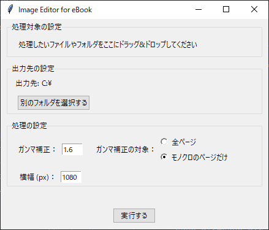
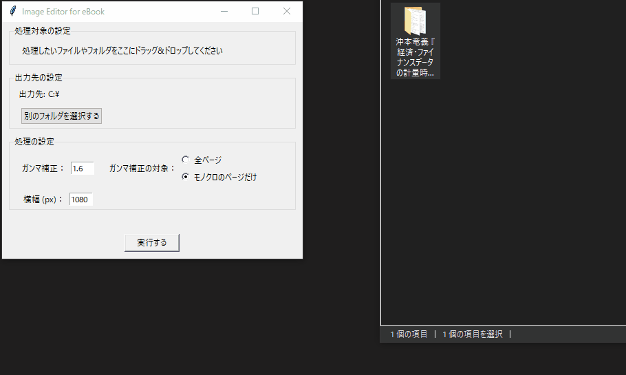

# image-editor-for-ebook

電子書籍の自作のための簡単な画像処理（ガンマ補正・リサイズ）を行うWindows用 GUIアプリ

## 使用方法

1. 処理したい画像やフォルダをドラッグ&ドロップしてください
2. 出力先を指定したい場合は設定してください
   - デフォルトでは入力元のディレクトリに`_edited`の接尾辞を付け足したディレクトリを新規作成してそこに出力します。
3. 必要に応じてガンマ補正や横幅の値を設定してください
